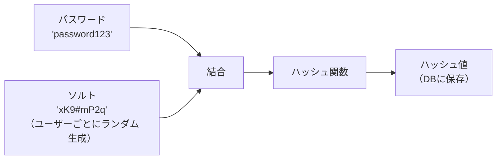

## はじめに

現在社会人5年目ですが、IT企業に勤めているもののPM業務を担っており技術力を磨けていないことに不安を抱いています。同期が技術力を蓄積している一方で、自分にはないことに焦りを感じています。

そこで、何か技術的専門性を持ちたいと思い「認証認可」という領域に一旦絞って学習を進めることを決めました。
今回はその学習記録記事の第1弾、「ハッシュ関数」について学んだことをまとめたいと思います。
Zennでは学習記録から始めて徐々に技術力を高めていきたいと思っています。最終的には多くの人にためになる記事を書けるようになりたいなと思います。

まだ初学者なので至らない部分があれば温かい目で見守っていただき、ご指摘いただければと思います。

この記事では、**なぜDBが漏洩してもパスワードは守られるのか**を「ハッシュ化」「低速ハッシュ」「ソルト」の3つの仕組みから解説します。

---

## なぜパスワードをそのまま保存してはいけないのか

これまで皆さんも様々なサービスにメールアドレスやパスワードを登録してアカウント作成をしたことがあると思います。
その時、もしサイトが攻撃されてパスワードが流出したらどうしようと思ったことはありませんか？

パスワードはサーバーのデータベース(DB)内に保存されているので、DBを攻撃されてしまうと一気に多数のパスワードが流出してしまいます。
それを防ぐためにパスワードはパスワードのままDB内に保存してはならず、代わりに「ハッシュ化」して保存するのです。

こうすることで本来のパスワードを攻撃者は見ることができず「ハッシュ値」しか確認できないわけです。
ただし、ハッシュ化だけでは実は不十分です。この記事では、さらに**低速ハッシュ**と**ソルト**という2つの仕組みも合わせて解説します。まずはハッシュ値とは何かから見ていきましょう。

---

## ハッシュ関数とは何か

今回学習を行ったことで、ハッシュ関数を一言で表すと「一方向性を持った変換によって、データが漏れても平文を守る仕組み」と理解しました。

あるメッセージをハッシュ関数に通すことによって、ハッシュ値という別の値に変換することができます。
ハッシュ関数の特徴として、ハッシュ値から元のメッセージを逆算することができないという「一方向性」というものがあります。これによって、もしハッシュ値が攻撃者に知られてしまっても、元のメッセージを割り出される心配がないのです。

似たような仕組みとして「暗号化」という概念もありますが、こちらについては「復号」によって元のメッセージを取り出すことができるという特徴があります。
この点については後ほどもう少し見ていければと思います。

### 雪崩効果：1文字の変化がハッシュ値を完全に変える

SHA-256 に文字列を入力すると、次のようになります。

| 入力 | ハッシュ値（SHA-256） |
|------|----------------------|
| `hello` | `2cf24dba5fb0a30e26e83b2ac5b9e29e1b161e5c1fa7425e73043362938b9824` |
| `hello!` | `6b0c2c4524a2a5b4d63aefdb3d90d40fbef4e04a9d5abe37f9c6ecae6e694b3f` |

ここではSHA-256というハッシュ関数を用いたハッシュ値の例を出しています。
上記の例から分かるように、「!」がついただけでハッシュ値が大きく異なっていることが見て取れると思います。

これを「雪崩効果 (Avalanche Effect)」といいます。
この効果によって元メッセージに改ざんが行われた際に事前に計算しておいたハッシュ値との整合が取れなくなるため、改ざんされたことを検知することができるのです。

このようにハッシュ関数を用いることによって元メッセージが「本物」であるということを確認することができます。
これを完全性 (integrity)などと言います。

---

## ハッシュ関数の重要な4つの性質

### ① 一方向性（Pre-image Resistance）

冒頭でも述べた通り、ハッシュ関数には「一方向性」という特徴があります。
これは、ハッシュ値からは元メッセージを逆算することができないという特徴です。

これによって、DBが流出してしまってもパスワードを復元される恐れがなく、利用者のパスワードを守ることができます。
暗号化は鍵を用いて「復号」することができますが、ハッシュ化は原理的に逆算できない設計になっているのです。

### ② 衝突耐性（Collision Resistance）

ハッシュ関数には「衝突耐性」という特徴もあります。
上で見てきたようにハッシュ関数には「雪崩効果」のように1文字違うだけでハッシュ値が大きく変化する特徴があり、それによって「完全性」を担保しているのです。

もし、異なる入力からでも同じハッシュ値を作ることができてしまうと、容易に改ざんや別のパスワードを使ったログインなどができてしまい、安全性が損なわれてしまいます。
このように異なるメッセージが同じハッシュ値を持つことを「衝突 (collision)」といいます。

ハッシュ関数はこうした衝突が起こらないような関数であり、「衝突耐性」があると言えます。

### ③ 決定性（Determinism）

ハッシュ関数の3つ目の特徴は決定性です。

これまで見てきたように、パスワード等は平文の状態でDBに保存されるわけではなく、ハッシュ値として保存されます。
もし正しいパスワードを用いてログインを試みているのにハッシュ値が一致せずにログインできないのだとしたら大きな問題です。

そこで、「同じメッセージからは同じハッシュ値が出力される」という特徴が必要となります。
これを「決定性」と言います。
ログイン時は、入力されたパスワードをその場でハッシュ化し、DBに保存済みのハッシュ値と比較します。元のパスワードを保存せずに照合できるのは、この決定性があるからです。

### ④ 固定長出力

ハッシュ関数の最後の特徴は「固定長出力」です。

入力が任意の長さであっても、出力結果は同じ長さにすることができます。
例えば、ハッシュ関数としてSHA-256を用いたとしたら出力は常に256bitで固定されます。

利便性を考慮すると、ハッシュ値は短いほど扱いがしやすくなります。
もし、長文のファイルを作成していたとします。それが改ざんされていないことを確認するためハッシュ値を算出したとします。そのハッシュ値が同じくらい長かったら元のメッセージを読んで確認するのと変わりません。

---

## なぜ SHA-256 をパスワード保存に使ってはいけないのか

ハッシュ関数には、SHA-256というものがあります。こちらはJWTの署名検証など、正規ユーザーが繰り返し高速に計算する必要がある場面で使われます。しかし、パスワードを保存することには向いていません。

その理由は、SHA-256が高速ハッシュ関数と呼ばれる、計算の非常に速い関数だからです。
なぜ高速な計算だと困るのか、それはブルートフォース攻撃に対して脆弱になるからです。

ブルートフォース攻撃とは総当たり攻撃とも呼ばれるもので、手当たり次第にパスワードを入力して正解のパスワードを探し求める攻撃手法を指します。
もしハッシュ値の計算が高速にできるのであれば、高速に総当たり攻撃を行うことができ、すぐに正解のパスワードを暴かれる可能性があります。

そのため、パスワードのように、流出すると大きな危険があるものに関しては、高速ハッシュ関数ではなく、計算に時間がかかる低速ハッシュ関数を使うことが推奨されます。

---

## bcrypt / Argon2：意図的に遅くする設計

では、低速ハッシュ関数とはどういったものがあるのでしょうか。
ここではbcrypt / Argon2を紹介します。

これらのハッシュ関数は、1回の計算に数百ミリ秒かかります。この時間は人間にとってはとても些細な時間なので大きな問題にはなりません。
例えば1回パスワードを入力する程度であれば、高速ハッシュ関数と比べても大きな差がないので気になりません。

しかし、ブルートフォース攻撃のように数百億回パスワードを入力する場合、その数百ミリ秒というのは大きくのしかかってきます。
結果としてブルートフォース攻撃を仕掛けた場合、パスワードをしらみつぶしに調べるのに数百年がかかってしまいます。

このように、パスワード等知られてはいけない情報を格納する場合、低速ハッシュ関数のような意図的に計算を遅くする仕組みがあえて利用されるのです。

そしてコスト係数というものを利用することによって、計算の重さをある程度自由に調整することができます。この性質を用いることによって、求められる速度と安全性のバランスを自由に取ることができるのです。

なお、現在はより新しく安全性の高いArgon2が推奨されることが多いです。bcryptも広く使われており、どちらも適切に設定すれば十分な安全性を持ちます。

---

## ソルト：レインボーテーブル攻撃を無効化する

### レインボーテーブル攻撃とは

他にもよく知られた攻撃手法として、レインボーテーブル攻撃があります。その仕組みを見ていきます。

レインボーテーブル攻撃とはよく使われるパスワードをあらかじめ用意しておき、それぞれについてハッシュ値を事前に計算しておく攻撃手法のことです。
この事前に計算しておいたリストと、攻撃によって取得したDBを比較することによって、パスワードを知ることができるのです。

例えば `password123` というパスワードを使っていたとします。このパスワードをSHA-256でハッシュ化した場合の値は世界中で常に同じものになります。
そのため、流出したデータベースに、このハッシュ値が載っていた場合、すぐにパスワードがばれてしまうのです。

### ソルトの仕組み

この問題を解決するために、導入されたものがソルトと呼ばれる仕組みです。
ソルトとはパスワードをハッシュ化する前に、ランダムな文字列をパスワードに付加する仕組みのことを言います。

これはハッシュ関数の雪崩効果を利用した仕組みになります。ソルトを付加したことによって、パスワードが大きく異なるハッシュ値に変わるのです。
こうすることにより、レインボーテーブルの事前に計算していたテーブルは使い物にならず、流出してしまったデータベースから元のパスワードを暴くことは困難になるのです。

また、ソルト自体は秘密の情報ではなく、単にレインボーテーブルによる事前の計算を無効化することが目的になります。
そのため、ソルトを平文でDBに保存しても特に問題はありません。

---

## よくある混同：「暗号化」「エンコード」との違い

最後にハッシュ化と暗号化、そしてエンコードの違いについて見ていきましょう。

| | 復元できるか | 主な用途 |
|--|--|--|
| **ハッシュ化** | ❌ 復元不可（原理的に） | パスワード保存、整合性検証、JWT署名 |
| **暗号化** | ✅ 鍵があれば復号可能 | データの秘匿（通信・保管） |
| **エンコード** | ✅ 誰でも復元可能 | データ形式の変換（Base64 など） |

ハッシュ化は一方向性があるので、ハッシュ値からメッセージを逆算することは原理的に不可能です。そのため、パスワードの保存に向いています。
さらに、完全性の観点から改ざんが行われていないかの検証に使うこともできます。

一方、暗号化は鍵さえ知っていれば自由に復号することが可能です。そのため、鍵を知っている人の間だけで秘密のデータをやりとりする目的で使われます。

エンコードは単なるデータ形式の変換を指します。そのため誰でも自由に復元することができます。つまり、パスワードや秘匿したいデータのやりとりには不向きですが、単純にデータの形式を変換したい場合には、誰でも扱えるというメリットがあるのです。

---

## まとめ：DB漏洩してもパスワードを守る3つの仕組み

この記事では、DBが漏洩してもパスワードを守る3つの仕組みを見てきました。

① **ハッシュ化**：一方向性によって、ハッシュ値から元のパスワードを復元することは原理的に不可能です。仮にDBが流出しても、攻撃者にはハッシュ値しか渡りません。

② **低速ハッシュ（bcrypt / Argon2）**：計算を意図的に遅くすることで、ブルートフォース攻撃にかかる時間を数百年規模に引き延ばします。

③ **ソルト**：ユーザーごとにランダムな文字列を付加することで、レインボーテーブルによる事前計算を無効化します。

「パスワードをDB保存するなら暗号化すればいい」と思っていた自分にとって、「暗号化ではなくハッシュ化」「高速ではなく低速ハッシュ」という設計の判断軸が一番の気づきでした。

---

## 次の記事

この記事では **「復元できない変換」＝ハッシュ関数** を扱いました。
次の記事では **「復元できる変換」＝暗号化** の2方式（共通鍵暗号・公開鍵暗号）と、それを組み合わせた電子署名の仕組みを扱います。

👉 記事2：暗号の2つの方式と電子署名（近日公開）

---

*認証認可 学習アウトプットシリーズ \#1*
