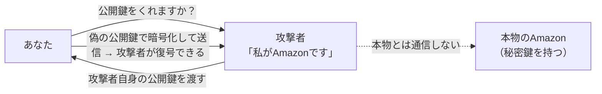
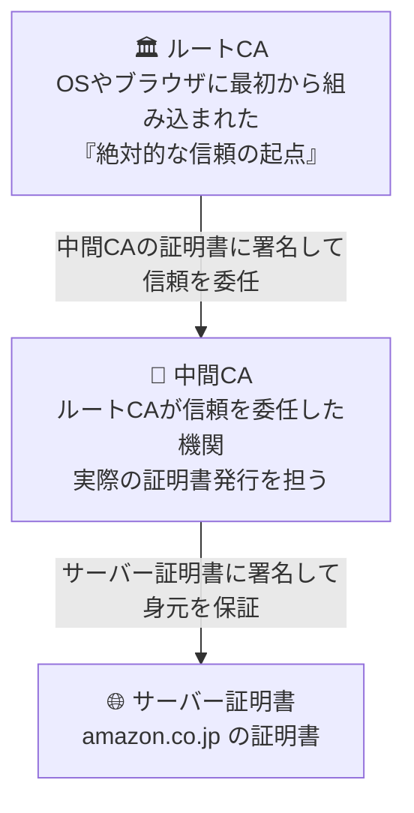
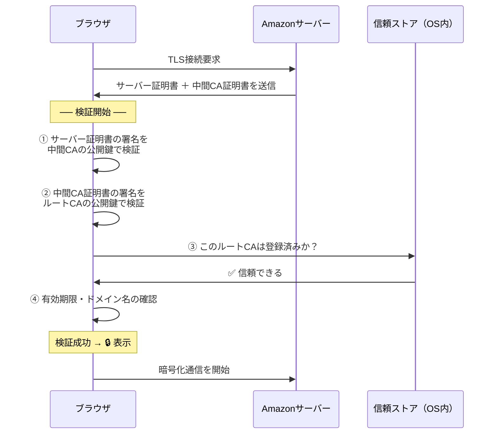

## はじめに

前回は暗号化技術と電子署名について見てきました。
電子署名は秘密鍵でメッセージのハッシュ値に署名し、受信者が送信者の公開鍵でその署名を検証・比較することで**真正性**や完全性を確認する技術でした。

しかし、攻撃者が自身の秘密鍵を使って送信者のフリをしていた場合、受信者は気付けるのでしょうか？

今回は、その問題を解決するためのPKIという考え方について見ていきましょう。
最終的にはブラウザのHTTPSとは何かを理解できるところが目標です。

---

## 電子署名だけでは解決できない問題

冒頭にも見たように、電子署名は送信者の秘密鍵でメッセージのハッシュ値に署名し、受信者がその人の公開鍵で署名を検証することで真正性を確認する技術でした。

しかし、送信者になりすました攻撃者のキーペアが使われていたとしても、受信者がそれを検知することは難しいという問題があります。

ここでは、代表的な攻撃手法であるMITM (Man in the Middle攻撃)を例に見ていきましょう。

攻撃者が「私がAmazonです」と名乗り、**自分自身の公開鍵**をあなたに渡したとします。あなたはその公開鍵でメッセージを暗号化して送信しますが、復号できるのは攻撃者だけです。本物のAmazonは最初から通信に関与しておらず、内容はすべて攻撃者に筒抜けになります。

さらに厄介なのは、この状況が**電子署名の検証をそのまま通過してしまう**点です。攻撃者の秘密鍵で署名し、あなたが持つ（偽の）公開鍵で検証すれば、整合性は成立してしまうからです。

電子署名は「この秘密鍵を持つ者が署名した」ことは証明できますが、「その持ち主が誰か」は証明できません。これが **公開鍵の身元保証問題** です。



---

## PKIとは何か

ここで登場するのが **PKI（Public Key Infrastructure：公開鍵基盤）** です。PKIとは、「この公開鍵はたしかにこの人のものだ」と権威ある第三者が保証する仕組みです。

現実世界のパスポートで考えてみましょう。パスポートは「私はこの人物です」と主張する証明書ですが、自分で手作りした書類では信用されません。外務省が身元を審査して発行した書類だからこそ、入国審査で受け入れられます。PKIでは、このような権威ある第三者機関を**認証局（CA: Certificate Authority）**と呼びます。

偽造を防ぐため、パスポートには特殊な印章や偽造防止加工が施されています。電子証明書にも同様に、CAが自身の秘密鍵で付与した電子署名が含まれており、証明書が正規に発行されたものであることを保証しています。

一方、信用できない国が発行したパスポートをそのまま受け入れるのは問題です。PKIでも同様に、「信頼できるCAが発行した証明書か」を確認する仕組みが必要であり、その役割を担うのが**信頼ストア**です。

| 現実世界（パスポート） | PKIの世界 |
| --- | --- |
| パスポート | 電子証明書（X.509証明書） |
| 外務省（発行機関） | 認証局（CA） |
| パスポートの印章・偽造防止加工 | CAの電子署名 |
| 信頼できる国のリスト | ブラウザ・OSの信頼ストア |
| 所持者の顔写真・氏名 | Subject フィールド（ドメイン名・組織名） |

### PKIの3つの構成要素

では、PKIの構成要素について見ていきましょう。

#### 認証局 (CA)
公開鍵の所有者を審査し、電子証明書を発行する機関です。代表的なものに **Let's Encrypt**（無料・自動化で広く普及）、**DigiCert**、**GlobalSign** などがあります。

#### 電子証明書
CAが発行する公開鍵の身元証明書です。CAが自身の電子署名を付与することで、受信者はどのCAによって身元確認が行われたかを検証できます。

#### 信頼ストア
信頼できるルートCAの一覧で、OSやブラウザにあらかじめ組み込まれています。Windows では「証明書ストア」、macOS では「キーチェーン」として管理されており、ここに登録されたCAが発行した証明書のみが信頼されます。

---

## 証明書の中身を読んでみる

ではここでは、実際に証明書の中身を見ていきましょう。
一般的なX.509証明書を例に見ていきます。

```text
Certificate:
  Subject:    CN=amazon.co.jp, O=Amazon.com Inc., C=US
              ↑ この証明書の所有者（ドメイン名・組織名）

  Issuer:     CN=Amazon RSA 2048 M02, O=Amazon, C=US
              ↑ この証明書を発行した認証局（CA）

  Serial:     0a:1b:2c:3d:4e:5f:6a:7b
              ↑ 証明書を一意に識別するID

  Valid From: 2024-01-01 00:00:00 UTC
  Valid To:   2025-01-01 23:59:59 UTC
              ↑ 有効期限

  SANs:       DNS: amazon.co.jp
              DNS: *.amazon.co.jp
              ↑ この証明書が有効なドメインの一覧

  Public Key: RSA 2048-bit
              30:82:01:0a:02:82:01:01:00:9c:...
              ↑ 公開鍵の本体（暗号化に使われる）

  Signature:  sha256WithRSAEncryption
              3a:7b:c9:12:e5:4d:88:f1:0b:...
              ↑ 上記すべてのフィールドをCAが秘密鍵で署名したもの（核心）
```

最後の `Signature` フィールドが証明書の核心です。CAは「SubjectのPublic Keyはたしかに本物だ」と保証するため、証明書内のすべてのフィールドをまとめてハッシュ化し、**CA自身の秘密鍵で電子署名**しています。これは前回解説した電子署名そのものです。

ブラウザはこの署名をCAの公開鍵で検証することで、「証明書が改ざんされていないか」「発行元が信頼できるCAか」の2点を確認しています。

---

## 信頼チェーン：なぜ3段階の構造なのか

次にCAから証明書が発行される流れを見ていきましょう。

OSやブラウザに組み込まれているCAは最上位の信頼が置かれている「ルートCA」と呼ばれる機関です。
信頼ストアに登録されるルートCAは世界でもごく限られた機関のみで、誰でもなれるものではありません。

世界中の個人や企業がそれらのルートCAから直接証明書を発行してもらうのは現実的ではありません。
そのため、各ルートCAが信頼を委任した「中間CA」から証明書を発行してもらう形が一般的です。

こんなことは基本ないと願いたいですが、もしルートCAの秘密鍵が漏洩してしまったとしたらどうでしょう。
その場合、そのルートCAに依存している証明書に対する信頼関係は崩れてしまいます。

しかし、中間CAを挟むことでもし中間CAの秘密鍵が漏洩してしまってもそこに紐づく証明書のみが影響を被るので、ルートCAよりも被害は局所的です。
こうしたリスク分散の観点でも中間CAは役立っているのです。



---

## ブラウザが証明書を検証する流れ

最後に、ブラウザがどのように証明書を検証していくのか、流れを確認していきましょう。

あるユーザがAmazonを見ようとしているとします。

このとき、まずユーザはAmazonのサーバに対してTLS接続要求というものを投げます。
それに対し、Amazonのサーバはサーバ証明書と中間CAの証明書を送信します。

ここからブラウザでの検証が始まります。
まず、サーバ証明書についている署名を中間CAの公開鍵を使って検証します。
もちろんここで検証が失敗したら接続失敗です。

次に中間CAの証明書についての検証を行います。ルートCAの公開鍵を使って検証するわけです。
その後、ルートCAが信頼ストアに登録されていることを確認します。つまり、ブラウザとして最上級に信頼できるかを確認するということです。

そこで信頼が確認できれば、Amazonのサーバ証明書自体に対して有効期限やドメイン名の確認作業を行います。
これで検証完了です。

その後は暗号化通信が開始されます。
このように証明書を検証して確立されたHTTP通信がHTTPSと呼ばれるのです。



---

## まとめ

今回学んだことを3点に整理します。

- **電子署名だけでは「鍵の持ち主が誰か」を証明できない**。正しく署名・検証できても、その公開鍵が本当に相手のものかどうかは保証されません。これがMITM攻撃の抜け穴でした。
- **PKIの3要素（認証局・電子証明書・信頼ストア）が連携して公開鍵の身元を保証する**。CAが審査・署名した証明書を、信頼ストアを使って検証することで、初めて「この公開鍵は本物だ」と言えます。
- **信頼チェーンの3層構造（ルートCA → 中間CA → サーバー証明書）がリスクを局所化する**。ルートCAを直接使わずに中間CAへ委任することで、万が一の秘密鍵漏洩時の被害範囲を最小化しています。

PKIを学ぶ前は、ブラウザの🔒マークを「暗号化されているサイン」としか捉えていませんでした。実際には、この複雑な信頼の連鎖がすべて検証を通過したことを意味するサインです。普段何気なく目にしているアイコンの裏側に、これほど緻密な仕組みが動いていると知ると、セキュリティの見方が少し変わります。

---

## 次の記事

今回でPKIの仕組みを通じて、「通信相手の身元を確認する」土台が整いました。

次回は、この仕組みを実際のHTTPS通信でどう活用するかを見ていきます。TLSハンドシェイクの中で、身元確認・鍵交換・暗号化通信の確立が一連の流れとして行われる全体像を解説します。

**次回：TLSとHTTPS通信 ― 🔒マークが出るまでの全ステップ**

---

*認証認可 学習アウトプットシリーズ \#3*
