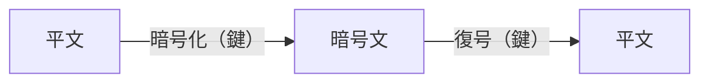
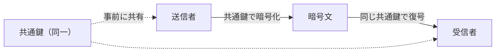
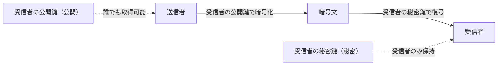
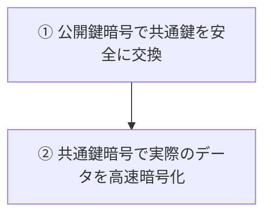
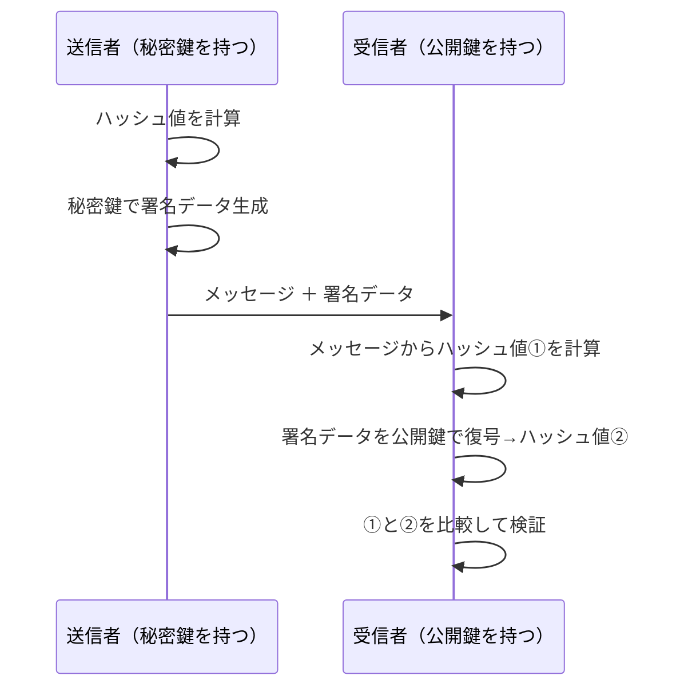
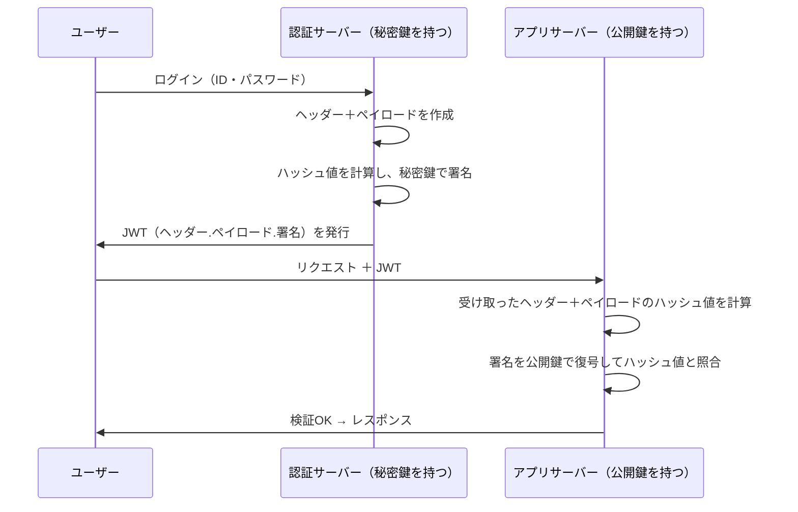

## はじめに

前回の記事はハッシュ関数について取り上げました。ハッシュ関数の特徴は一方向性があり、メッセージを逆算できないということが挙げられていました。

今回は鍵を使って復元できる暗号化の技術について見ていきたいと思います。
その中で共通鍵暗号方式と公開鍵暗号方式、そして電子署名の使い分けについても言及できればと思います。

---

## ハッシュ化との違い：「暗号化」とは何か

暗号化では平文に対して鍵を用いることにより暗号文を生成します。
この暗号文はそのままで読むことができません。

暗号文を読むためには、復号という手順を踏む必要があります。
暗号文に対して鍵を用いることによって、平文を取り出すことができるのです。
つまり、鍵を持っていない人は平文を読むことができないのです。

この暗号化に用いる鍵と復号に用いる鍵、これらが同じか異なるかによって、共通鍵暗号方式か公開鍵暗号方式に分かれてくるのです。

---

## 共通鍵暗号：速いが「鍵配送問題」がある

では、まず共通鍵暗号について見ていきましょう。
こちらは先ほども見てきたように、暗号化と復号に同じ鍵を使うのが特徴です。他にも対称暗号とも呼ばれます。

暗号化と復号に同じ鍵を使うという特徴から、あらかじめ送信者と受信者が同じ鍵を共有しておく必要があります。
しかし、鍵はとても大切なものなので、どうやって安全に共有するのかという鍵配送問題が出てくるのです。

鍵は大切なので暗号化して送らないといけない。しかしその暗号化するためにはまた新たな鍵が必要となる。ではその交換するための鍵を暗号化して配送しないといけないという。堂々巡りのジレンマを「鍵配送問題」と呼びます。

では、なぜそこまでして、共通鍵暗号方式を使いたいんでしょうか。
それは処理が非常に速く、大量のデータでも暗号化・復号に適しているという特徴があるからです。

現在では、AESなどが代表的なアルゴリズムとして使われております。
TLSの暗号通信においても、実際に使われているアルゴリズムになっています。

---

## 公開鍵暗号：2種類の鍵で鍵配送問題を解く

それでは、公開鍵暗号方式はどういったものなのか見ていきましょう。
こちらは暗号化と復号に異なる2つの鍵を使います。非対称暗号とも呼ばれます。

この異なる2つの鍵は、公開鍵と秘密鍵の2種類に分かれます。
公開鍵は誰に見られても問題ありません。一方、秘密鍵は外部に流出してはいけなく、鍵の持ち主本人のみが知っている必要があります。

では、公開鍵暗号方式の流れについて見ていきましょう。
送信者は受信者の公開鍵を使って平文を暗号化します。公開鍵は誰に見られても問題ないという特徴から一般に公開されているので、送信者は簡単に公開鍵を得ることができます。
そうして暗号化された暗号文を送信者は受信者に送ります。この暗号文の復号は受信者のみが知っている秘密鍵を使って行われます。

こうして安全に暗号文のやりとりをすることができるのです。

このように聞くと、共通鍵暗号方式と比べて、公開鍵暗号方式の方が便利なのではと感じるんではないでしょうか。
しかし、公開鍵暗号方式には大きな問題があります。
それは共通鍵暗号方式と比べて、暗号化・復号にかなり時間を要してしまうため、大量のデータのやり取りには向いていないという課題があります。

つまり、鍵配送問題については考える必要はないものの、処理が遅いという特徴があるのです。

---

## ハイブリッド暗号：2つの方式の「いいとこ取り」

この公開鍵暗号方式と共通鍵暗号方式のメリット・デメリットを上手に組み合わせたのが、ハイブリッド暗号方式です。

共通鍵暗号方式は、処理速度が速いものの鍵配送問題があります。
公開鍵暗号方式は、鍵配送問題を気にせず簡単に暗号文をやりとりできますが、処理速度が遅いという問題があります。

そこで、データのやりとりは共通鍵暗号方式を使って高速に行うものの、その共通鍵自体は公開鍵暗号方式で共有するのです。
こうすることで、鍵配送問題を気にすることなく共通鍵を共有することができるのです。

実際にTLSなどのプロトコルにおいてもこの方式が使われており、httpsの通信は安全に守られていると言えるでしょう。

---

## 電子署名：公開鍵暗号の「逆使い」

少し話題は変わりますが、次に電子署名について見ていきましょう。
こちらについても、実は公開鍵暗号方式の特徴を使って実現されています。

秘密鍵は本人しか知らない一方、公開鍵はみんな知っているという特徴を使って署名を行うのです。

本人しか知らない秘密鍵を使ってデータを暗号化する。それをその本人の公開鍵を使って他の人が復号する。もし、うまくいったのであれば、それは本人の秘密鍵を使ってデータが暗号化されていたという証明になります。
つまり、本人が作った情報であると証明できるのです。
これによってなりすましを防止できます。

鍵の向きを整理すると、通常の暗号化と電子署名では使い方が逆になっています。

|  | 暗号化（通常の使い方） | 電子署名（逆使い） |
|---|---|---|
| 変換 | **公開鍵**で暗号化 | **秘密鍵**で署名 |
| 復元・検証 | **秘密鍵**で復号 | **公開鍵**で検証 |
| 目的 | 情報の秘匿（受信者だけが読める） | 真正性・完全性の証明（本人性の確認） |

暗号化の目的は「特定の相手だけに読ませること」であるのに対し、電子署名の目的は「誰でも検証できるが、本人しか作れないこと」です。鍵の向きを逆にすることで、まったく別の問題を解決できるようになっています。

---

## 電子署名の詳細：ハッシュ関数との合わせ技

そして、電子署名はハッシュ関数と組み合わせることによって改ざんを検知することもできます。
前回見てきたように、ハッシュ関数には改ざんが行われると雪崩効果が発生します。

ここで一つ疑問が生まれます。なぜ電子署名にわざわざハッシュ関数を組み合わせるのでしょうか。それは、公開鍵暗号は処理が重く、大きなデータに対して直接署名するのが現実的ではないからです。そこでまずメッセージ全体のハッシュ値、いわばメッセージの「指紋」を計算し、その小さなハッシュ値だけに署名を行います。こうすることで処理の効率を保ちつつ、改ざんも検知できるようになるのです。

この特徴を組み合わせて改ざん検知も行っています。
ここでは、その流れについて見ていきましょう。

まずメッセージに署名する側について見ていきます。
送り主がメッセージを作った後、ハッシュ関数を使ってハッシュ値を計算します。それに対して秘密鍵を使って暗号化を行います。これが署名データとなります。
この署名データとメッセージ本文を合わせて受信者に送ります。

受信者は受け取ったメッセージをハッシュ関数にかけてハッシュ値を計算します。
次に署名データに対して公開鍵を使って復号を行いハッシュ値を取り出します。この2つのハッシュ値が一致しているのであれば、改ざんがされていないといえるでしょう。

もし一致しないのであれば、メッセージが改ざんされている可能性があります。もしくは署名に使われた暗号鍵が送り主のものと異なっており、なりすましが行われている可能性もあります。

---

## 認証認可での使われ方：JWT署名

最後にこうした暗号化の技術が認証認可でどのように使われているかについて見ていきましょう。
ここでは、JWT署名を例に見ていきます。

JWT署名とはJSON Web Token署名のことで、トークンを用いた認証方式です。
アプリケーション側にユーザ情報を持たせず、事前に発行したトークンをリクエスト毎にユーザが含めて送る方法になります。
詳細についてはまた別記事で解説したいと思います。

JWTは(ヘッダー、ペイロード、署名)の3部構成になっており、"."(ドット)区切りにした形で記述されます。

細かいことは省きますが、ペイロード部分がJWTの本体とも言える部分で、その中に識別子なども含まれています。それにヘッダーを付加してエンコードを行います。
そうしてエンコードされたものに対して署名を行います。

受信者(アプリ側)はヘッダーを確認してエンコードのアルゴリズムを確認し、ヘッダーとペイロードをエンコードし、値を確認します。
その後、署名を復号して値を比較し認証を行います。

こうすることで、なりすましや改ざんの有無を確認して安全に認証を進めることができるのです。

---

## よくある誤解の整理

ここではよくある誤解について整理していきたいと思います。
今回は暗号化と電子署名について見てきました。

暗号化は平文を暗号文に変えて、情報を秘匿するのが目的です。
一方、電子署名は、情報の秘匿が目的ではなく、改ざんされていないことや本人による署名であることを確認するのが目的です。つまり、完全性や正真性を明らかにするのが電子署名の役割なのです。

そして、それらの役割目的に応じて、暗号化に公開鍵を使うのか、それとも秘密鍵を使うのかの考え方が異なってきます。
情報を秘匿して正しい受信者だけに読んでほしい場合は、公開鍵を使って暗号化します。
一方、メッセージを作ったのが本人であることを証明したい場合は、本人しか用いない秘密鍵を使って暗号化を行っていくのです。

---

## まとめ

本記事では、共通鍵暗号・公開鍵暗号・電子署名という3つの概念を順に見てきました。

共通鍵暗号は暗号化と復号に同じ鍵を使うため処理速度は速いのですが、その鍵をどうやって安全に渡すかという鍵配送問題がつきまといます。公開鍵暗号はその問題を「誰に見られてもよい公開鍵」と「本人だけが持つ秘密鍵」の2つで解決しますが、今度は処理速度が遅くなるという別の課題があります。TLSなどの実際のプロトコルでは、両者のいいとこ取りをしたハイブリッド方式を採用することでこの問題を解消しています。

電子署名は、この公開鍵暗号の仕組みを「逆向き」に使ったものです。秘密鍵で署名し公開鍵で検証することで、「本人が送ったものであること」と「途中で改ざんされていないこと」を同時に確かめることができます。JWTの署名もまさにこの仕組みの上に成り立っており、認証サーバーに問い合わせることなくトークンを検証できる理由もここにあります。

「JWTってなんとなく安全らしい」という理解から、「どの鍵で何を署名し、どのように検証しているのか」を自分の言葉で説明できる状態になっていれば、この記事のゴールは達成できています。

---

## 次の記事

本記事で「公開鍵を使った暗号化・署名」の仕組みを理解しました。しかし、ここで新たな疑問が生まれます。

> 「Aさんの公開鍵です」と配布されている公開鍵が、**本当にAさんのものだと誰が保証するのか？**

悪意ある攻撃者が「私がAさんです」と偽った公開鍵を配布していた場合、電子署名の信頼性そのものが崩れてしまいます。

次回はこの「公開鍵の正当性をどう保証するか」という問いに答える、**PKI（公開鍵基盤）と電子証明書** の仕組みを解説します。

**次回：PKIと電子証明書 ― 公開鍵の「身元保証」はどう行われるか**

---

*認証認可 学習アウトプットシリーズ \#2*
